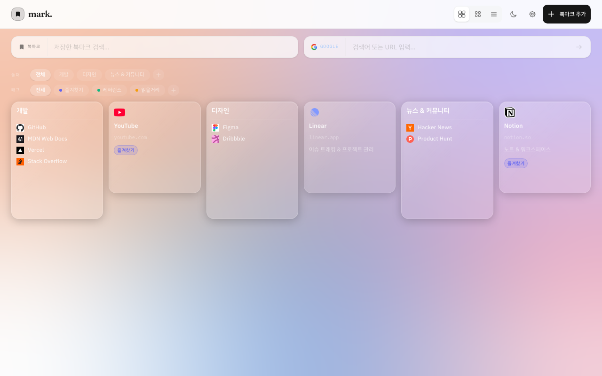
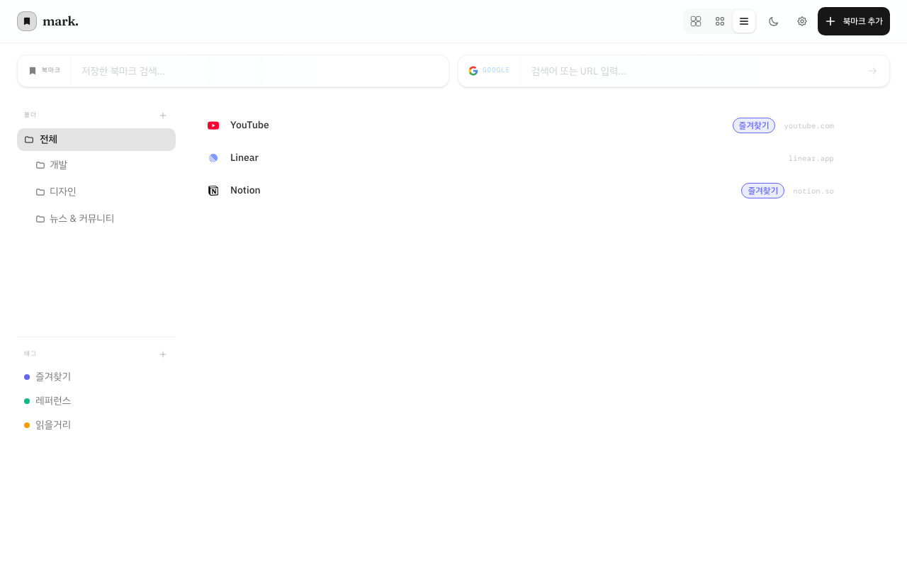
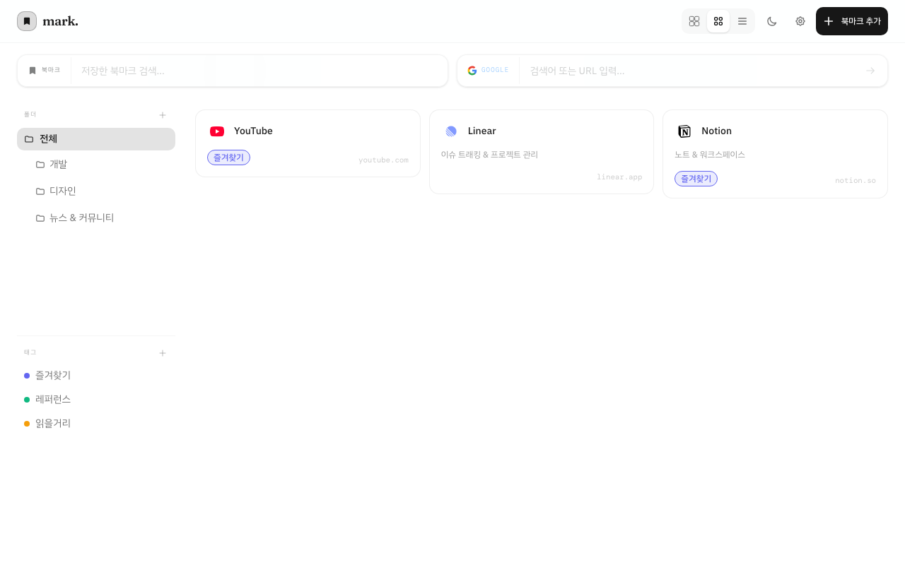
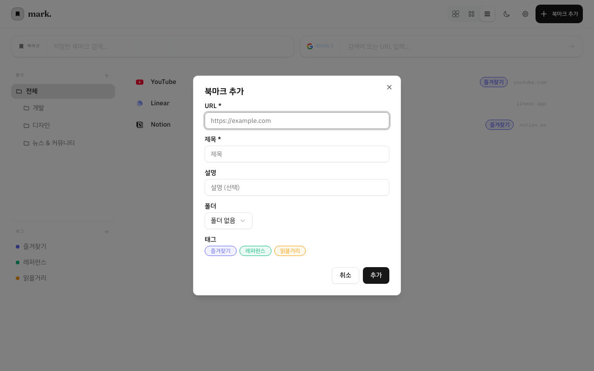
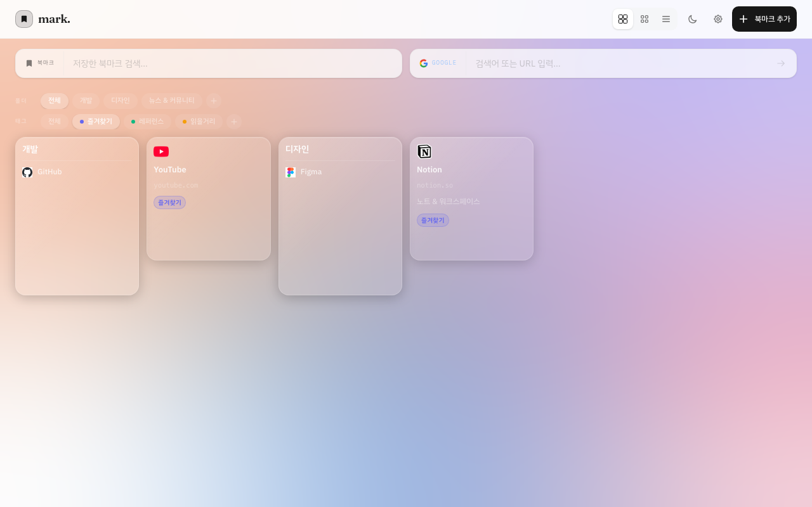

# mark.

새 탭을 북마크 허브로 바꿔주는 Chrome 확장 프로그램



---

## 주요 기능

- **새 탭 오버라이드** — 새 탭을 열면 바로 북마크 대시보드
- **3가지 뷰 모드** — Glass / 그리드 / 리스트
- **폴더 & 태그** — 북마크를 체계적으로 분류
- **빠른 검색** — 제목·URL로 즉시 필터링
- **Chrome 북마크 동기화** — 단방향·양방향 실시간 동기화
- **팝업 퀵 추가** — 현재 탭을 툴바에서 바로 저장

---

## 스크린샷

| Glass 뷰 | 리스트 + 사이드바 |
|---|---|
|  |  |

| 그리드 뷰 | 북마크 추가 |
|---|---|
|  |  |

| 태그 필터 |
|---|
|  |

---

## 프로젝트 구조

```
apps/
  web/        # 새 탭 페이지 (React + Vite)
  extension/  # Chrome 확장 프로그램 (팝업 + newtab 번들)
  api/        # 백엔드 API (NestJS)
packages/
  ui/         # 공통 컴포넌트 (shadcn/ui 기반)
  types/      # 공유 타입 정의
  api-client/ # Axios 클라이언트 + ChromeStorageAdapter
```

**아키텍처:** FSD (Feature-Sliced Design)

---

## 기술 스택

| 영역 | 스택 |
|---|---|
| Frontend | React 19, Tailwind CSS v4, shadcn/ui |
| 상태 관리 | Zustand, TanStack Query |
| 빌드 | Vite, Turborepo, pnpm workspaces |
| 코드 품질 | TypeScript, Biome (lint/format) |
| 테스트 | Vitest, Playwright |

---

## 시작하기

```bash
# 의존성 설치
pnpm install

# 개발 서버 (web + extension 동시)
pnpm dev

# 타입 체크
pnpm check-types

# 린트 & 포맷
pnpm check

# 테스트
pnpm --filter @repo/web test
```

---

## Chrome 확장 프로그램 빌드

```bash
# 전체 빌드 + extension.zip 생성
pnpm build:ext
```

생성된 `extension.zip`을 [Chrome Web Store 개발자 대시보드](https://chrome.google.com/webstore/devconsole)에 업로드하세요.

**개발자 모드로 로컬 로드:**

1. Chrome → `chrome://extensions` → 개발자 모드 ON
2. `앱 압축해제하여 로드` → `apps/extension/dist` 선택

---

## 스크린샷 갱신

```bash
node scripts/capture-screenshots.mjs
```

---

## 데이터 저장

기본 모드에서는 모든 데이터를 **Chrome 로컬 스토리지**에만 저장합니다. 외부 서버로 데이터가 전송되지 않습니다.
